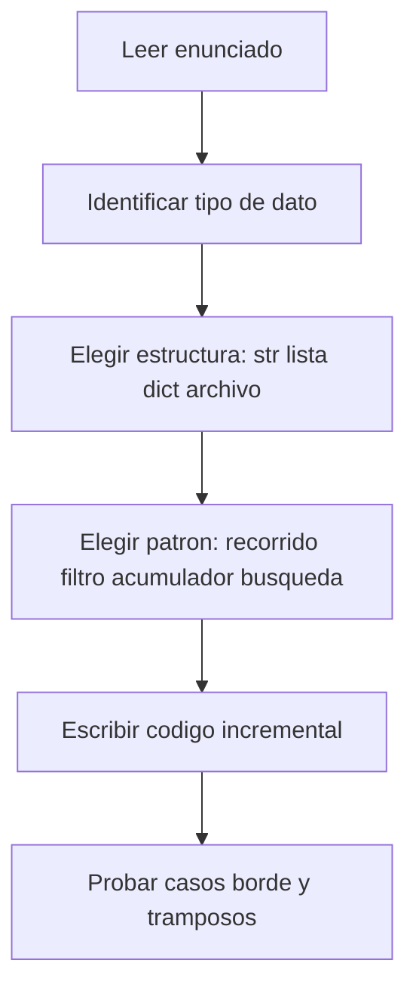
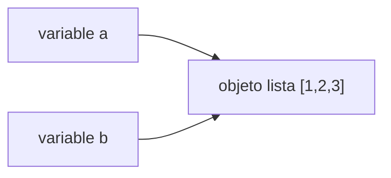
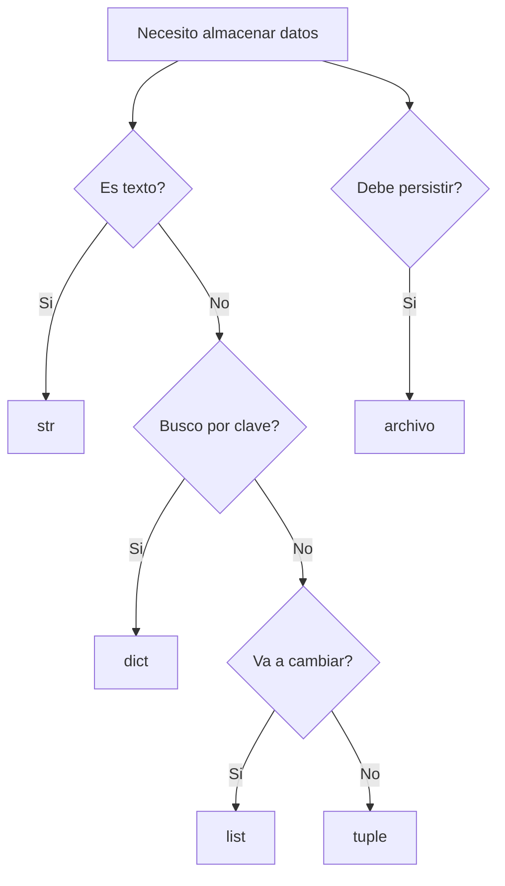

# Guía de estudio — Programación 1 (Python)

> Material refactorizado a partir de las diapositivas 40–88 del curso.  
> Objetivo: no solo memorizar sintaxis, sino **construir el modelo mental** para razonar y resolver problemas en guías, parciales y situaciones reales.

---

## Índice

1. [Cómo usar esta guía](#cómo-usar-esta-guía)
2. [Prerrequisitos mínimos](#prerrequisitos-mínimos)
3. [Estrategia para enfrentar un ejercicio](#estrategia-para-enfrentar-un-ejercicio)
4. [Bloque A — Cadenas (str)](#bloque-a--cadenas-str)
5. [Bloque B — Archivos](#bloque-b--archivos)
6. [Bloque C — Listas (list)](#bloque-c--listas-list)
7. [Bloque D — Objetos, referencias y alias](#bloque-d--objetos-referencias-y-alias)
8. [Bloque E — Diccionarios (dict)](#bloque-e--diccionarios-dict)
9. [Bloque F — Tuplas (tuple)](#bloque-f--tuplas-tuple)
10. [Bloque G — Síntesis: elegir la estructura correcta](#bloque-g--síntesis-elegir-la-estructura-correcta)
11. [Patrones transversales de parcial](#patrones-transversales-de-parcial)
12. [Apéndice: glosario y cheat sheet](#apéndice-glosario-y-cheat-sheet)

---

## Cómo usar esta guía

Cada tema sigue una estructura fija pensada para el aprendizaje activo:

| Sección | Para qué sirve |
|---------|----------------|
| **Idea en una frase** | Resumen mental rápido |
| **Modelo mental** | Analogía que te ayuda a *pensar* el concepto |
| **Sintaxis esencial** | Referencia rápida |
| **Ejemplos progresivos** | De lo simple a lo integrador |
| **Por qué funciona** | Explicación línea por línea del ejemplo clave |
| **Cómo razonar** | Checklist para resolver ejercicios |
| **ERROR COMÚN** | Qué falla, por qué y cómo evitarlo |
| **TRAMPA DE PARCIAL** | Casos donde muchos se confunden |

**Convención:** ejecutá los ejemplos en Python. Escribilos, modificá valores, rompelos a propósito. Aprender programación sin escribir código es como aprender a nadar leyendo un manual.

---

## Prerrequisitos mínimos

Este material (slides 40–88) asume que ya viste lo siguiente en clases anteriores. Si algo no te suena, repasalo antes de seguir.

### Variables y tipos básicos

```python
nombre = "Ana"      # str  — texto
edad = 20           # int  — entero
promedio = 8.5      # float — decimal
aprobado = True     # bool — True o False

print(nombre, edad)  # imprime valores separados por espacio
```

Una **variable** es un nombre que apunta a un valor almacenado en memoria. El signo `=` **asigna**; no significa "igual" como en matemática.

### Condicionales y bucles

```python
# if — ejecutar solo si se cumple una condición
if edad >= 18:
    print("Mayor de edad")

# while — repetir mientras la condición sea True
contador = 0
while contador < 3:
    print(contador)
    contador = contador + 1

# for — repetir para cada elemento de una secuencia
for letra in "hola":
    print(letra)
```

### Funciones útiles que reaparecen constantemente

```python
len("hola")    # 4 — longitud de una secuencia
range(5)       # 0, 1, 2, 3, 4 — genera enteros
type(42)       # <class 'int'> — tipo del objeto
int("42")      # 42 — convertir texto a entero
float("3.14")  # 3.14
str(42)        # "42" — convertir a texto
```

### Regla de oro de los índices

En Python, **el primer elemento por posición es 0, no 1**. Si una cadena tiene 6 caracteres, los índices válidos van de `0` a `5`. Esto no es un capricho de Python: es la convención en casi todos los lenguajes modernos porque simplifica cálculos con offsets en memoria.

---

## Estrategia para enfrentar un ejercicio

Antes de escribir código, hacete estas preguntas en orden:



| Pregunta | Ejemplo de respuesta |
|----------|---------------------|
| ¿De dónde vienen los datos? | Un archivo `mbox.txt`, una cadena, input del usuario |
| ¿Qué estructura necesito? | Recorrer líneas → archivo; contar por categoría → dict |
| ¿Cuál es el patrón? | Filtro (`if line.startswith(...)`), acumulador (`total = total + x`) |
| ¿Qué parte del dato me interesa? | Solo el dominio del email, no toda la línea |
| ¿Qué casos borde existen? | Archivo vacío, línea sin `@`, clave que no existe en el dict |

**Consejo:** escribí primero la versión más simple que resuelva un caso concreto, probala, y recién después generalizá.

---

# Bloque A — Cadenas (str)

*Slides 41–49*

---

## A.1 — ¿Qué es una cadena?

### Idea en una frase

Una cadena (`str`) es una **secuencia ordenada e inmutable de caracteres**.

### Modelo mental

Imaginá una filera de casilleros numerados, empezando en **0**:

```
Índice:  0   1   2   3   4   5
         b   a   n   a   n   a
         ↑
       fruta[0] → 'b'
```

Cada casillero tiene exactamente un carácter. Podés *mirar* cualquier casillero, pero **no podés cambiar** lo que hay adentro (inmutabilidad — ver A.4).

### Sintaxis esencial

| Operación | Sintaxis | Resultado con `fruta = "banana"` |
|-----------|----------|-------------------------------|
| Acceder por índice | `fruta[i]` | `fruta[0]` → `'b'` |
| Índice negativo | `fruta[-1]` | `'a'` (último carácter) |
| Longitud | `len(fruta)` | `6` |
| Rebanado | `fruta[n:m]` | Ver sección A.3 |
| Concatenar | `"a" + "b"` | `"ab"` |
| Repetir | `"ha" * 3` | `"hahaha"` |

### Ejemplo 1 — Indexación básica

```python
fruta = "banana"
letra = fruta[1]
print(letra)       # a
print(fruta[0])    # b
print(fruta[-1])   # a  (último)
print(fruta[-2])   # n  (penúltimo)
print(len(fruta))  # 6
```

### Por qué funciona

- `fruta[1]` pide "el carácter en la posición 1". Como empezamos en 0, la posición 1 es la **segunda** letra: `'a'`.
- `fruta[-1]` es atajo para "el último". Equivale a `fruta[len(fruta) - 1]`, o sea `fruta[5]`.
- `len(fruta)` devuelve **cuántos caracteres** hay, no el índice del último. Con 6 caracteres, el último índice es 5.

### ERROR COMÚN — IndexError

```python
fruta = "banana"
print(fruta[6])   # IndexError: string index out of range
print(fruta[10])  # IndexError
```

**Causa:** los índices válidos van de `0` a `len(fruta) - 1`. El índice 6 no existe.

**Fix:** antes de acceder, preguntate: ¿mi índice es menor que `len(cadena)`? Si viene de `find()`, verificá que no sea `-1`.

### TRAMPA DE PARCIAL

```python
cadena = "Python"
# ¿Cuál es el último índice válido?
# Respuesta: 5 (porque len = 6, índices 0..5)
# Muchos responden 6 por confundir longitud con índice máximo.
```

---

## A.2 — Recorrer una cadena

### Idea en una frase

Un **recorrido** (traversal) procesa cada elemento de una secuencia, uno por uno, desde el inicio hasta el fin.

### Modelo mental

Es como leer un libro letra por letra: tomás la primera, hacés algo con ella, pasás a la siguiente, y repetís hasta terminar.

### Con `while` — control manual del índice

```python
fruta = "banana"
indice = 0
while indice < len(fruta):
    letra = fruta[indice]
    print(indice, letra)
    indice = indice + 1
```

**Salida:**
```
0 b
1 a
2 n
3 a
4 n
5 a
```

### Con `for` — Python maneja el índice por vos

```python
fruta = "banana"
for letra in fruta:
    print(letra)
```

**Respuesta al slide 42:** sí, se puede hacer con `for`, y es la forma **más común y recomendada** cuando solo necesitás el valor de cada carácter, no su posición.

### ¿Cuándo usar `while` vs `for`?

| Situación | Usá |
|-----------|-----|
| Procesar cada carácter sin importar su posición | `for letra in cadena` |
| Necesitás el índice explícitamente | `while` con contador, o `for i in range(len(cadena))` |
| Querés avanzar de a 2 posiciones, o saltar ciertos índices | `while` (más control) |

### Ejemplo — Contar vocales

```python
fruta = "banana"
contador = 0
for letra in fruta:
    if letra == "a":
        contador = contador + 1
print(contador)  # 3
```

### Cómo razonar

1. ¿Necesito cada carácter? → recorrido.
2. ¿Necesito saber en qué posición está? → índice (`while` o `range(len(...))`).
3. ¿Qué hago con cada uno? → acumular, comparar, imprimir, etc.

### ERROR COMÚN — Bucle infinito con `while`

```python
indice = 0
while indice < len(fruta):
    print(fruta[indice])
    # Olvidé incrementar indice → bucle infinito
```

**Fix:** siempre asegurate de que algo en el cuerpo del `while` acerque la condición a `False`.

---

## A.3 — Rebanado (slicing)

### Idea en una frase

Un **rebanado** extrae un segmento de la cadena usando la sintaxis `[inicio:fin]`.

### Modelo mental — la regla semiabierta

Pensá en una **ventana** sobre los casilleros:

```
fruta = "banana"
       0 1 2 3 4 5
       b a n a n a

fruta[1:4]  →  posiciones 1, 2, 3  →  "ana"
              ↑ incluye      ↑ excluye (el 4 no entra)
```

**Regla:** `[n:m]` incluye el índice `n`, **excluye** el índice `m`. La cantidad de caracteres es `m - n`.

### Sintaxis de rebanado

| Expresión | Significado | `"banana"[...]` |
|-----------|-------------|-----------------|
| `[n:m]` | Desde n hasta m (sin incluir m) | `[1:4]` → `"ana"` |
| `[:m]` | Desde el inicio hasta m | `[:3]` → `"ban"` |
| `[n:]` | Desde n hasta el final | `[3:]` → `"ana"` |
| `[:]` | Copia completa | `"banana"` |
| `[::-1]` | Invertida | `"ananab"` |

### Ejemplos progresivos

```python
fruta = "banana"

print(fruta[0:3])   # "ban"  — primeros 3 caracteres
print(fruta[3:6])   # "ana"  — últimos 3 caracteres
print(fruta[:3])    # "ban"  — omitir inicio = desde 0
print(fruta[3:])    # "ana"  — omitir fin = hasta el final
print(fruta[:])     # "banana" — copia entera
print(fruta[1:5])   # "anan"
```

### Por qué funciona `[1:4]` → `"ana"`

- Índice 1 → `'a'` ✓ incluido
- Índice 2 → `'n'` ✓ incluido
- Índice 3 → `'a'` ✓ incluido
- Índice 4 → `'n'` ✗ excluido

Resultado: `"ana"` (3 caracteres = 4 - 1).

### TRAMPA DE PARCIAL

```python
s = "abcdef"
# ¿Cuántos caracteres tiene s[1:4]?
# Respuesta: 3 (índices 1, 2, 3), NO 4.
# La longitud del rebanado es fin - inicio, no fin.
```

```python
s = "hello"
# ¿Qué devuelve s[2:2]?
# Respuesta: "" (cadena vacía). Inicio y fin iguales → nada.
```

### ERROR COMÚN — Confundir índice con cantidad

```python
# Quiero los primeros 3 caracteres
s = "banana"
print(s[3])    # "n" — UN solo carácter en posición 3
print(s[0:3])  # "ban" — TRES caracteres (posiciones 0, 1, 2)
```

---

## A.4 — Las cadenas son inmutables

### Idea en una frase

**No podés modificar un carácter individual** de una cadena existente; tenés que crear una cadena nueva.

### Modelo mental

Los casilleros están **sellados**. Si querés cambiar una letra, construís una cadena nueva con el cambio, no alterás la original.

```python
fruta = "banana"
# fruta[0] = "B"   # TypeError: 'str' object does not support item assignment
```

### ¿Cómo "cambiar" una cadena entonces?

```python
fruta = "banana"
nueva = "B" + fruta[1:]   # "Banana" — cadena nueva
print(fruta)   # "banana" — la original no cambió
print(nueva)   # "Banana"
```

### Por qué importa esto

- Si dos variables apuntan a la misma cadena, "modificar" una no afecta a la otra (porque no hay modificación real).
- Los métodos de cadena como `upper()` **no cambian** la original; devuelven una **nueva** cadena.

```python
s = "hola"
t = s.upper()
print(s)  # "hola"  — sin cambios
print(t)  # "HOLA"  — nueva cadena
```

### ERROR COMÚN

```python
nombre = "juan"
nombre[0] = "J"  # TypeError
# Fix:
nombre = "J" + nombre[1:]
```

---

## A.5 — El operador `in` y comparaciones

### Idea en una frase

`in` verifica si una cadena aparece como **subcadena** dentro de otra. Los operadores `==`, `!=`, `<`, `>` comparan cadenas **lexicográficamente** (como en un diccionario).

### Operador `in`

```python
"a" in "banana"      # True  — 'a' aparece en algún lugar
"an" in "banana"     # True  — "an" es subcadena
"xyz" in "banana"    # False
"ban" in "banana"    # True
```

**Clave:** `in` busca la subcadena **en cualquier posición**, no solo como carácter aislado en un índice particular.

### Comparaciones

```python
"apple" == "apple"   # True  — mismo contenido
"apple" != "banana"  # True
"apple" < "banana"   # True  — 'a' == 'a', luego 'p' < 'n'? No: 'p' > 'n'... 
                     # En realidad: compara carácter a carácter:
                     # 'a'=='a', 'p' vs 'a' → 'p' > 'a' → "apple" > "banana"
```

Comparación lexicográfica: Python compara el primer carácter diferente. Si uno es prefijo del otro, el más corto es "menor":

```python
"app" < "apple"   # True — "app" es prefijo, más corto
"Z" < "a"         # True — mayúsculas tienen código menor que minúsculas en ASCII
```

### TRAMPA DE PARCIAL

```python
# ¿Cuál es la diferencia?
"a" in "banana"       # True — subcadena
"banana"[0] == "a"    # False — banana[0] es 'b', no 'a'
"banana"[1] == "a"    # True — posición 1 sí es 'a'
```

```python
# ¿Qué devuelve esto?
"" in "banana"   # True — la cadena vacía está "contenida" en cualquier cadena
```

---

## A.6 — Métodos de cadenas

### Idea en una frase

Un **método** es una función atada a un objeto. Se invoca con la sintaxis `objeto.metodo(argumentos)`.

### Modelo mental

La cadena es un objeto que "sabe hacer cosas" consigo misma: convertirse a mayúsculas, buscar un texto, partirse en pedazos, etc.

### Explorar métodos disponibles

```python
fruta = "banana"
print(type(fruta))   # <class 'str'>
print(dir(fruta))    # lista larga de métodos; algunos empiezan con __ (internos)
```

En el parcial y en la práctica, los más usados son:

| Método | Qué hace | Ejemplo |
|--------|----------|---------|
| `upper()` | Mayúsculas | `"hola".upper()` → `"HOLA"` |
| `lower()` | Minúsculas | `"HOLA".lower()` → `"hola"` |
| `find(sub)` | Posición de subcadena, o `-1` | `"banana".find("na")` → `2` |
| `startswith(pref)` | ¿Empieza con prefijo? | `"From: x".startswith("From:")` → `True` |
| `endswith(suf)` | ¿Termina con sufijo? | `"file.txt".endswith(".txt")` → `True` |
| `replace(viejo, nuevo)` | Reemplaza ocurrencias | `"a-b".replace("-", ".")` → `"a.b"` |
| `strip()` | Quita espacios/saltos al inicio y fin | `"  hola \n".strip()` → `"hola"` |
| `split(sep)` | Parte en lista | `"a,b,c".split(",")` → `['a','b','c']` |

### Ejemplos con explicación

```python
linea = "From stephen.marquard@uct.ac.za Sat Jan  5 09:14:16 2008"

# ¿Empieza con "From"?
print(linea.startswith("From"))   # True

# ¿Dónde está el @?
pos = linea.find("@")
print(pos)   # 21

# Extraer desde después del @ hasta el espacio
inicio = linea.find("@") + 1
fin = linea.find(" ", inicio)
dominio = linea[inicio:fin]
print(dominio)   # uct.ac.za
```

### Por qué funciona la extracción del dominio

1. `find("@")` localiza el arroba → posición 21.
2. `inicio = 21 + 1 = 22` → primer carácter **después** del `@`.
3. `find(" ", 22)` busca el primer espacio **a partir de** la posición 22.
4. `linea[22:fin]` rebanado semiabierto → `"uct.ac.za"`.

### Alternativa con `split`

```python
linea = "From stephen.marquard@uct.ac.za Sat Jan  5 09:14:16 2008"
partes = linea.split()          # parte por espacios en blanco
email = partes[1]               # "stephen.marquard@uct.ac.za"
dominio = email.split("@")[1]   # "uct.ac.za"
print(dominio)
```

**Razonamiento:** `split()` sin argumentos divide por espacios. La segunda "palabra" (índice 1) es el email. Luego `split("@")` separa usuario y dominio.

### ERROR COMÚN — `find` devuelve -1

```python
linea = "Subject: Re: hello"
pos = linea.find("@")
if pos:           # ¡TRAMPA! -1 es "truthy" en el sentido de... 
    print("Tiene @")
# En realidad: -1 es truthy en Python (solo 0, None, "", [], {} son falsy)
# Pero el problema real es otro enfoque:

if linea.find("@") != -1:    # Forma correcta
    print("Tiene @")

if linea.find("@") >= 0:      # También correcta
    print("Tiene @")
```

**Causa:** si no hay `@`, `find` devuelve `-1`. Si usás ese valor como índice (`linea[pos]`), obtenés el **último carácter**, no un error.

```python
s = "hola"
pos = s.find("@")   # -1
print(s[pos])       # "a" — ¡el último carácter! No da error.
```

### TRAMPA DE PARCIAL

```python
"banana".find("na")    # 2  — primera ocurrencia
"banana".find("na", 3) # 4  — buscar a partir del índice 3
"banana".find("x")     # -1 — no encontrado
```

---

## A.7 — Operador de formato `%`

### Idea en una frase

Cuando `%` aparece entre una cadena y un valor (no entre dos números), es el **operador de formato**: inserta valores dentro de un template de texto.

### Ojo: `%` tiene dos significados

```python
# Operador módulo (resto de división) — entre números
print(10 % 3)   # 1

# Operador de formato — cadena a la izquierda
nombre = "Ana"
edad = 20
print("Me llamo %s y tengo %d años" % (nombre, edad))
# Me llamo Ana y tengo 20 años
```

### Códigos de formato comunes

| Código | Tipo | Ejemplo |
|--------|------|---------|
| `%s` | cadena (string) | `"Hola %s" % "mundo"` |
| `%d` | entero (decimal) | `"Edad: %d" % 25` |
| `%f` | float | `"Pi: %f" % 3.14159` |
| `%g` | float "general" (menos decimales) | `"Pi: %g" % 3.14159` |

```python
camisetas = 5
precio = 19.99
print("Compré %d camisetas a $%g cada una" % (camisetas, precio))
# Compré 5 camisetas a $19.99 cada una
```

### ERROR COMÚN

```python
# Cantidad de placeholders debe coincidir con valores
" %s %d" % ("Ana",)       # ValueError — falta el entero
" %d" % "no soy numero"   # TypeError
```

### TRAMPA DE PARCIAL

```python
# ¿Qué imprime?
print("%d %d" % (1.5, 2))   # 1 2 — %d trunca el float a entero, no redondea "bien"
```

---

## A.8 — Ejercicios resueltos (Cadenas)

### Ejercicio 1 — Extraer dominio de email (slide 47)

**Enunciado:** Dada la línea  
`From stephen.marquard@uct.ac.za Sat Jan  5 09:14:16 2008`  
obtener `uct.ac.za`.

```python
linea = "From stephen.marquard@uct.ac.za Sat Jan  5 09:14:16 2008"

# Método A: find + rebanado
arroba = linea.find("@")
espacio = linea.find(" ", arroba)
dominio = linea[arroba + 1 : espacio]
print(dominio)

# Método B: split
palabras = linea.split()
email = palabras[1]
dominio = email.split("@")[1]
print(dominio)
```

**Razonamiento:** identifico dos delimitadores naturales: `@` (inicio del dominio) y el espacio posterior (fin del dominio). O bien parto en "palabras" y trabajo sobre la que contiene el email.

### Ejercicio 2 — Contar cuántas veces aparece una letra

```python
fruta = "banana"
letra_buscada = "a"
contador = 0
for letra in fruta:
    if letra == letra_buscada:
        contador = contador + 1
print(contador)  # 3
```

### Ejercicio propuesto (sin solución)

Dada la cadena `"  hello world  "`, obtener `"Hello World"` (primera letra de cada palabra en mayúscula, sin espacios extra al inicio/fin).  
*Pista:* `strip()`, `split()`, y podés armar la solución con un bucle o con métodos encadenados si ya los viste.*

---

# Bloque B — Archivos

*Slides 50–57*

---

## B.1 — ¿Qué es un archivo?

### Idea en una frase

Un **archivo** es datos persistidos en memoria secundaria (disco, USB) que sobreviven al apagar la computadora.

### Modelo mental

El archivo es un **libro en una biblioteca**. Tu programa no recibe el libro entero de golpe: pide un **pase (handle)** al bibliotecario (sistema operativo) para leer o escribir páginas.

```
Programa  --open()-->  Sistema Operativo  --handle-->  Archivo en disco
                              |
                         si no existe → error
                         si no tenés permiso → error
```

Un **archivo de texto** se puede pensar como una **secuencia de líneas**, cada una terminada en un carácter de nueva línea `\n` (Enter).

---

## B.2 — Abrir y leer archivos

### Sintaxis esencial

```python
manejador = open(nombre_archivo, modo)
# modos comunes: "r" (read), "w" (write), "a" (append)
# al terminar:
manejador.close()
```

### Leer línea por línea con `for` (patrón más común)

```python
f = open("mbox.txt")
for linea in f:
    print(linea)
f.close()
```

**Importante:** cada `linea` incluye el `\n` final. Por eso ves un salto de línea extra si hacés `print(linea)` (print agrega otro `\n`).

```python
# Para evitar doble salto:
print(linea.strip())   # strip() quita \n y espacios al inicio/fin
```

### Leer el archivo entero

```python
f = open("mbox.txt")
contenido = f.read()    # una sola cadena con todo el archivo
f.close()
print(len(contenido))
```

Usá `read()` solo si el archivo es **pequeño** respecto a tu memoria RAM.

### Contar líneas

```python
f = open("mbox.txt")
contador = 0
for linea in f:
    contador = contador + 1
f.close()
print("Total de líneas:", contador)
```

### Por qué funciona el `for linea in f`

Python lee hasta encontrar `\n`, te entrega esa línea (con el `\n` incluido), y avanza automáticamente. No tenés que manejar el "cursor" del archivo manualmente.

### Buena práctica — `with` (opcional pero recomendada)

```python
with open("mbox.txt") as f:
    for linea in f:
        print(linea.strip())
# f.close() se llama automáticamente al salir del bloque
```

Si el curso no lo exige en parcial, igual conviene conocerlo.

### ERROR COMÚN — FileNotFoundError

```python
f = open("no_existe.txt")   # FileNotFoundError
```

**Causa:** el archivo no está en la ruta indicada (nombre mal escrito, carpeta incorrecta, extensión faltante).

**Fix:** verificá la ruta. Si el script está en otra carpeta, la ruta es relativa al directorio desde donde ejecutás Python.

### ERROR COMÚN — Olvidar `close()`

Si no cerrás el archivo, los datos en buffer pueden no escribirse completamente y el sistema mantiene recursos abiertos. En programas cortos del parcial no suele explotar, pero es mala práctica.

---

## B.3 — Buscar en un archivo

### Patrón: leer + filtrar + procesar

```python
f = open("mbox.txt")
for linea in f:
    if linea.startswith("From:"):
        print(linea.strip())
f.close()
```

### Buscar con `find`

```python
f = open("mbox.txt")
for linea in f:
    if linea.find("@uct.ac.za") >= 0:
        print(linea.strip())
f.close()
```

**Razonamiento:** no necesito procesar todas las líneas. Primero **filtro** las que me interesan, después **proceso** solo esas.

### Ejemplo integrador — Dominios de emails "From"

```python
f = open("mbox.txt")
for linea in f:
    if not linea.startswith("From "):
        continue                    # saltar líneas que no me interesan
    partes = linea.split()
    email = partes[1]
    dominio = email.split("@")[1]
    print(dominio)
f.close()
```

Notá: `"From "` (con espacio) vs `"From:"` (con dos puntos). En mbox real las líneas de remitente suelen ser `From nombre@...` sin dos puntos. **Leé el formato del enunciado con cuidado.**

### TRAMPA DE PARCIAL

```python
linea = "From: stephen@uct.ac.za\n"

# ¿Cuál funciona siempre?
linea == "From:"              # False — la línea tiene más texto y \n
linea.startswith("From:")     # True
linea.startswith("From")      # True también en este caso
```

---

## B.4 — Escribir archivos

### Modo `"w"` — write (¡sobreescribe!)

```python
f = open("salida.txt", "w")
f.write("Primera línea\n")
f.write("Segunda línea\n")
f.close()
```

**Advertencia crítica:** si `salida.txt` ya existía, `"w"` **borra todo el contenido anterior** antes de escribir.

### Modo `"a"` — append (agregar al final)

```python
f = open("log.txt", "a")
f.write("Nueva entrada\n")
f.close()
```

El contenido previo se conserva; lo nuevo se agrega al final.

### `write()` no agrega `\n` automáticamente

```python
f = open("out.txt", "w")
f.write("línea 1")
f.write("línea 2")   # queda "línea 1línea 2" en una sola línea
f.close()

# Correcto:
f.write("línea 1\n")
f.write("línea 2\n")
```

### ERROR COMÚN — Pisar datos accidentalmente

```python
# Quiero agregar una línea, pero abrí en "w" por error
f = open("datos.txt", "w")   # ¡Perdiste todo lo que había!
f.write("nueva linea\n")
f.close()
# Fix: usar "a" para agregar, o leer primero y reescribir con cuidado
```

---

## B.5 — Modificar un archivo

### Idea clave

**No podés editar un archivo "en el medio"** de forma sencilla como en un Word. El patrón típico es:

1. Leer todo (o línea por línea) en memoria.
2. Transformar los datos en variables/listas/cadenas.
3. Escribir el resultado en un archivo (nuevo o reemplazando con `"w"`).

```python
# Duplicar un archivo cambiando "From:" por "Origen:"
entrada = open("original.txt")
salida = open("copia.txt", "w")
for linea in entrada:
    nueva = linea.replace("From:", "Origen:")
    salida.write(nueva)
entrada.close()
salida.close()
```

---

## B.6 — Ejercicios (Archivos)

### Ejercicio resuelto — Contar líneas que empiezan con "From:"

```python
contador = 0
f = open("mbox.txt")
for linea in f:
    if linea.startswith("From:"):
        contador = contador + 1
f.close()
print("Líneas From:", contador)
```

### Ejercicio resuelto — Extraer hora de líneas "From"

Línea ejemplo: `From stephen.marquard@uct.ac.za Sat Jan  5 09:14:16 2008`

```python
f = open("mbox.txt")
for linea in f:
    if linea.startswith("From "):
        partes = linea.split()
        hora = partes[5]       # "09:14:16"
        print(hora)
f.close()
```

**Razonamiento:** partí por espacios, identificá qué índice corresponde al dato pedido contando desde 0.

### Ejercicio propuesto

Escribir un programa que lea `mbox.txt` y genere `uct-emails.txt` con solo las líneas que contienen `@uct.ac.za`.

---

# Bloque C — Listas (list)

*Slides 58–66*

---

## C.1 — ¿Qué es una lista?

### Idea en una frase

Una lista es una **secuencia ordenada y mutable** de valores de cualquier tipo.

### Modelo mental

Un **estante con cajones numerados**. Podés mirar cualquier cajón, cambiar su contenido, agregar cajones al final, sacar cajones, o reordenarlos.

```
Índice:  0     1     2
         [10,  20,  30]
         ↑ mutable: numeros[1] = 99 → [10, 99, 30]
```

A diferencia de las cadenas, **sí podés modificar** elementos in-place.

### Crear listas

```python
numeros = [10, 20, 30, 40]           # 4 enteros
frutas = ["manzana", "banana", "cereza"]  # 3 cadenas
mixta = [1, "hola", 3.14, True]       # tipos mezclados — válido
vacia = []                            # lista vacía
anidada = [[1, 2], [3, 4]]           # listas dentro de listas
```

### Asignar elementos a variables (desempaquetado simple)

```python
numeros = [10, 20, 30]
a = numeros[0]   # 10
b = numeros[1]   # 20
```

---

## C.2 — Acceso, mutabilidad e índices negativos

```python
numeros = [10, 20, 30, 40]

print(numeros[0])    # 10
print(numeros[-1])   # 40 — último
numeros[1] = 99      # modificar in-place
print(numeros)       # [10, 99, 30, 40]

# Operador in
print(20 in numeros)      # False (cambiamos el 20 por 99)
print(99 in numeros)      # True
print(100 in numeros)     # False
```

La sintaxis de indexación y rebanado es **idéntica** a la de las cadenas, pero las listas permiten asignación:

```python
numeros = [0, 1, 2, 3, 4, 5]
numeros[2:4] = [20, 30]   # reemplaza índices 2 y 3
print(numeros)            # [0, 1, 20, 30, 4, 5]
```

---

## C.3 — Recorrer listas

### Solo lectura — `for` directo

```python
frutas = ["manzana", "banana", "cereza"]
for fruta in frutas:
    print(fruta)
```

### Necesitás modificar por índice — `range` + `len`

```python
numeros = [1, 2, 3, 4, 5]
for i in range(len(numeros)):
    numeros[i] = numeros[i] * 2
print(numeros)   # [2, 4, 6, 8, 10]
```

**Regla:** si solo leés → `for item in lista`. Si escribís en posiciones → necesitás el índice.

### ERROR COMÚN — Modificar mientras recorrés

```python
numeros = [1, 2, 3, 4, 5]
for n in numeros:
    if n % 2 == 0:
        numeros.remove(n)   # ¡Comportamiento impredecible!
```

**Fix:** recorré una copia, o construí una lista nueva con los elementos que querés conservar.

---

## C.4 — Operaciones de listas

```python
a = [1, 2, 3]
b = [4, 5]

# Concatenar — crea lista NUEVA
c = a + b
print(c)   # [1, 2, 3, 4, 5]
print(a)   # [1, 2, 3] — a no cambió

# Repetir
print([0] * 5)   # [0, 0, 0, 0, 0]

# Rebanado
print(a[1:3])    # [2, 3]
```

---

## C.5 — Métodos de listas

### `append`, `extend`, `sort`

```python
lista = [3, 1, 4]

lista.append(1)        # agrega UN elemento al final
print(lista)           # [3, 1, 4, 1]

lista.extend([5, 6])   # agrega CADA elemento de otra lista
print(lista)           # [3, 1, 4, 1, 5, 6]

resultado = lista.sort()   # ordena in-place
print(resultado)           # None  ← ¡IMPORTANTE!
print(lista)               # [1, 1, 3, 4, 5, 6]
```

### TRAMPA DE PARCIAL — `append` vs `extend`

```python
a = [1, 2, 3]
a.append([4, 5])
print(a)   # [1, 2, 3, [4, 5]]  — UNA lista anidada como 4to elemento

b = [1, 2, 3]
b.extend([4, 5])
print(b)   # [1, 2, 3, 4, 5]    — dos elementos agregados
```

### TRAMPA DE PARCIAL — `sort()` devuelve `None`

```python
numeros = [3, 1, 4, 1, 5]
ordenados = numeros.sort()
print(ordenados)   # None — no es la lista ordenada
print(numeros)     # [1, 1, 3, 4, 5] — la original sí se ordenó
```

**Regla:** métodos que modifican la lista in-place (`sort`, `append`, `extend`, `reverse`) devuelven `None`. No los asignes a una variable.

---

## C.6 — Eliminar elementos

```python
lista = ["a", "b", "c", "d", "e"]

# pop — elimina por índice y DEVUELVE el valor
ultimo = lista.pop()      # elimina "e"
print(ultimo)             # e
print(lista)              # ['a', 'b', 'c', 'd']

segundo = lista.pop(1)    # elimina "b"
print(lista)              # ['a', 'c', 'd']

# del — elimina sin devolver
del lista[0]
print(lista)              # ['c', 'd']

# remove — elimina por VALOR (primera ocurrencia)
lista = ["a", "b", "c", "b"]
lista.remove("b")
print(lista)              # ['a', 'c', 'b'] — solo la primera 'b'

# del con rebanado — eliminar varios
lista = [0, 1, 2, 3, 4, 5]
del lista[1:4]
print(lista)              # [0, 4, 5]
```

### ERROR COMÚN

```python
lista = [1, 2, 3]
lista.remove(5)   # ValueError: list.remove(x): x not in list
```

---

## C.7 — Funciones built-in con listas

```python
numeros = [3, 1, 4, 1, 5, 9, 2, 6]

print(len(numeros))   # 8
print(max(numeros))   # 9
print(min(numeros))   # 1
print(sum(numeros))   # 31
```

**Advertencia:** `sum` solo funciona si todos los elementos son numéricos. `max`/`min` funcionan con cadenas (orden lexicográfico) si todos son del mismo "tipo comparable".

---

## C.8 — Listas y cadenas

### Modelo mental

Una cadena es secuencia de **caracteres**. Una lista es secuencia de **valores**.  
`list("hola")` → `['h','o','l','a']` — **no** es lo mismo que `"hola"`.

```python
# Cadena → lista de caracteres
s = "hola"
chars = list(s)
print(chars)   # ['h', 'o', 'l', 'a']

# Cadena → lista de palabras
linea = "From stephen.marquard@uct.ac.za Sat"
palabras = linea.split()
print(palabras)
# ['From', 'stephen.marquard@uct.ac.za', 'Sat']

# split con delimitador
datos = "a,b,c"
partes = datos.split(",")
print(partes)   # ['a', 'b', 'c']

# join — inverso de split (es método de str, no de list)
palabras = ["hola", "mundo"]
oracion = " ".join(palabras)
print(oracion)   # "hola mundo"

sin_espacios = "".join(["a", "b", "c"])
print(sin_espacios)   # "abc"
```

### ERROR COMÚN — `join` al revés

```python
palabras = ["a", "b", "c"]
# palabras.join(" ")   # AttributeError — join es de str, no de list
" ".join(palabras)      # Correcto
```

---

## C.9 — Ejercicios (Listas)

### Ejercicio resuelto — Promedio de una lista de números

```python
numeros = [10, 20, 30, 40]
total = 0
for n in numeros:
    total = total + n
promedio = total / len(numeros)
print(promedio)   # 25.0
```

### Ejercicio resuelto — Histograma simple (puente a dict)

```python
palabras = ["a", "b", "a", "c", "b", "a"]
conteo = [0, 0, 0]   # índice 0='a', 1='b', 2='c' — frágil

# Mejor con dict (ver Bloque E):
conteo = {}
for p in palabras:
    if p not in conteo:
        conteo[p] = 0
    conteo[p] = conteo[p] + 1
print(conteo)   # {'a': 3, 'b': 2, 'c': 1}
```

### Ejercicio propuesto

Dada la lista `[3, 1, 4, 1, 5, 9, 2, 6]`, crear una nueva lista solo con los elementos mayores a 3, sin modificar la original.

---

# Bloque D — Objetos, referencias y alias

*Slides 68–70*

---

## D.1 — Objetos y valores

### Idea en una frase

Una variable no **contiene** el valor; **apunta** (referencia) a un objeto en memoria.

### Modelo mental — etiquetas en cajas

```
Variable "a" ──→  objeto "banana"  (en memoria)
Variable "b" ──→  objeto "banana"  (¿mismo objeto u otro igual?)
```

Dos variables pueden apuntar al **mismo objeto** o a **objetos distintos con el mismo valor**.

```python
a = "banana"
b = "banana"
c = a

print(a == b)   # True — mismo valor
print(a is b)   # Puede ser True o False (optimización interna de Python)
print(a is c)   # True — c se asignó desde a, misma referencia
```

### `==` vs `is`

| Operador | Pregunta que responde |
|----------|----------------------|
| `==` | ¿Tienen el **mismo valor/contenido**? |
| `is` | ¿Son el **mismo objeto** en memoria? |

**En parciales:** usá `==` para comparar contenido. Usá `is` principalmente con `None`:

```python
valor = None
if valor is None:
    print("No hay valor")
```

### TRAMPA DE PARCIAL

```python
a = [1, 2, 3]
b = [1, 2, 3]
print(a == b)   # True  — mismo contenido
print(a is b)   # False — dos listas distintas en memoria
```

```python
# Strings pequeños: Python a veces reutiliza el mismo objeto (interning)
x = "hola"
y = "hola"
print(x is y)   # Puede ser True — no confíes en esto para razonar

# Con strings construidos dinámicamente, casi seguro False:
x = "ho" + "la"
y = "hola"
print(x == y)   # True
print(x is y)   # Depende — no uses is para comparar strings
```

---

## D.2 — Referencias y alias

### Idea en una frase

Asignar `b = a` **no copia** la lista; hace que `b` sea un **alias** (otro nombre) para el mismo objeto.



```python
a = [1, 2, 3]
b = a           # b es alias de a — mismo objeto
b.append(4)
print(a)        # [1, 2, 3, 4] — ¡a también cambió!
print(b)        # [1, 2, 3, 4]
print(a is b)   # True
```

### Mutabilidad + alias = efectos secundarios

Si el objeto es **mutable** (lista, dict), cambiar por un alias afecta a todos los nombres que apuntan a él.

Si el objeto es **inmutable** (str, int, tuple), "modificar" crea un objeto nuevo y reasigna solo esa variable:

```python
a = "hola"
b = a
b = b + "!"     # crea "hola!" nuevo, b apunta ahí
print(a)        # "hola" — sin cambios
print(b)        # "hola!"
```

### Cómo hacer una copia independiente

```python
a = [1, 2, 3]

b = a           # alias — NO es copia
c = a[:]         # copia superficial (shallow copy)
d = list(a)      # equivalente a a[:]

b.append(99)
c.append(100)

print(a)   # [1, 2, 3, 99]     — b la modificó
print(b)   # [1, 2, 3, 99]
print(c)   # [1, 2, 3, 100]    — copia independiente
print(d)   # [1, 2, 3]         — no afectada
```

---

## D.3 — Listas como argumentos de funciones

```python
def agregar_final(letras):
    letras.append("z")

t = ["a", "b", "c"]
agregar_final(t)
print(t)   # ['a', 'b', 'c', 'z'] — la lista original cambió
```

**Razonamiento:** el parámetro `letras` y la variable `t` son alias del **mismo objeto lista**. La función no recibe una copia automática.

### Modificar vs crear nueva lista

```python
def agregar_mal(letras):
    letras = letras + ["z"]   # crea lista NUEVA, letras apunta a ella
    # la lista original afuera no cambia

def agregar_bien(letras):
    letras.append("z")        # modifica la lista existente

t = ["a", "b"]
agregar_mal(t)
print(t)   # ['a', 'b'] — sin cambios

agregar_bien(t)
print(t)   # ['a', 'b', 'z']
```

| Operación | ¿Modifica original? | ¿Devuelve algo? |
|-----------|---------------------|-----------------|
| `lista.append(x)` | Sí | `None` |
| `lista + [x]` | No — crea nueva | Nueva lista |
| `lista.sort()` | Sí | `None` |
| `sorted(lista)` | No | Nueva lista |

### TRAMPA DE PARCIAL

```python
def misterio(lista=[]):
    lista.append(1)
    return lista

print(misterio())   # [1]
print(misterio())   # [1, 1]  — ¡misma lista default reutilizada!
```

En Programación 1 alcanza con saber: **no uses listas mutables como valor default de parámetros**. Usá `None` y creá la lista adentro.

---

## D.4 — Ejercicios (Referencias)

### Ejercicio resuelto — Predecir salida

```python
x = [1, 2]
y = x
y[0] = 99
print(x)        # [99, 2]
print(x is y)   # True
```

### Ejercicio propuesto

Sin ejecutar: ¿qué imprime este código?

```python
def duplicar(nums):
    nums = nums * 2
    return nums

original = [1, 2, 3]
resultado = duplicar(original)
print(original)
print(resultado)
```

<details>
<summary>Respuesta</summary>

`[1, 2, 3]` y `[1, 2, 3, 1, 2, 3]`.  
`nums = nums * 2` crea una **nueva** lista; `original` no se modifica.

</details>

---

# Bloque E — Diccionarios (dict)

*Slides 72–79*

---

## E.1 — ¿Qué es un diccionario?

### Idea en una frase

Un diccionario es una colección de **pares clave → valor** donde buscás por clave, no por posición numérica.

### Modelo mental — agenda telefónica

```
Clave (nombre)    →    Valor (teléfono)
"Ana"             →    "555-1234"
"Bob"             →    "555-5678"
```

No buscás "el contacto en la posición 2"; buscás **por nombre**.

### Crear diccionarios

```python
# Vacío
conteo = dict()
conteo = {}

# Con elementos iniciales
edades = {"Ana": 20, "Bob": 22, "Carlos": 19}
print(edades)
# {'Ana': 20, 'Bob': 22, 'Carlos': 19}
```

El formato `{"clave": valor}` es también **formato de salida** cuando imprimís un dict.

---

## E.2 — Acceder y modificar

```python
edades = {"Ana": 20, "Bob": 22}

print(edades["Ana"])    # 20
edades["Ana"] = 21      # modificar valor existente
edades["Diana"] = 18    # agregar par nuevo
print(edades)
# {'Ana': 21, 'Bob': 22, 'Diana': 18}
```

### ERROR COMÚN — KeyError

```python
edades = {"Ana": 20}
print(edades["Bob"])   # KeyError: 'Bob' — clave no existe
```

**Fix:** usá `get` si la clave puede no existir.

---

## E.3 — `len`, `in` y búsqueda en valores

```python
edades = {"Ana": 20, "Bob": 22, "Carlos": 19}

print(len(edades))        # 3 — cantidad de pares
print("Ana" in edades)    # True  — busca en CLAVES
print(20 in edades)       # False — 20 es un valor, no una clave
print(20 in edades.values())  # True
```

### TRAMPA DE PARCIAL

```python
d = {"a": 1, "b": 2}
# ¿Qué devuelve?
"a" in d          # True  — 'a' es clave
1 in d            # False — 1 NO es clave (es valor)
1 in d.values()   # True
```

**Regla:** `in` sobre un dict siempre busca en las **claves**, nunca en los valores.

---

## E.4 — Método `get`

```python
edades = {"Ana": 20, "Bob": 22}

# Forma directa — falla si no existe
# print(edades["Carlos"])   # KeyError

# Forma segura — valor default si falta
print(edades.get("Carlos"))         # None
print(edades.get("Carlos", 0))      # 0
print(edades.get("Ana"))            # 20
```

### TRAMPA DE PARCIAL

```python
d = {"x": None}
print(d.get("x"))       # None — la clave existe, valor es None
print(d.get("y"))       # None — la clave NO existe
print("y" in d)         # False — podés distinguir los casos
print("x" in d)         # True
```

Si `get` devuelve `None`, verificá si la clave existe con `in` antes de concluir que "no hay valor".

---

## E.5 — Bucles y diccionarios

### Iterar claves (comportamiento default del `for`)

```python
conteo = {"a": 3, "b": 2, "c": 1}
for clave in conteo:
    print(clave, conteo[clave])
# a 3
# b 2
# c 1
```

El `for` sobre un dict recorre las **claves**. Para obtener el valor, usá `dict[clave]`.

### Ordenar claves alfabéticamente

```python
conteo = {"c": 1, "a": 3, "b": 2}
for clave in sorted(conteo):
    print(clave, conteo[clave])
# a 3
# b 2
# c 1
```

`sorted(conteo)` es equivalente a `sorted(conteo.keys())`.

---

## E.6 — Patrón histograma / contador

El patrón más importante de parcial con diccionarios:

```python
# Contar cuántas veces aparece cada palabra
palabras = ["a", "b", "a", "c", "b", "a"]
conteo = {}

for palabra in palabras:
    if palabra not in conteo:
        conteo[palabra] = 0
    conteo[palabra] = conteo[palabra] + 1

print(conteo)   # {'a': 3, 'b': 2, 'c': 1}
```

### Con `get` (más compacto)

```python
conteo = {}
for palabra in palabras:
    conteo[palabra] = conteo.get(palabra, 0) + 1
```

**Razonamiento paso a paso:**
1. Si la clave no existe, `get` devuelve 0.
2. Sumamos 1.
3. Guardamos el nuevo conteo.

### Ejemplo integrador — Contar dominios de email en mbox

```python
dominios = {}

f = open("mbox.txt")
for linea in f:
    if linea.startswith("From "):
        email = linea.split()[1]
        dominio = email.split("@")[1]
        dominios[dominio] = dominios.get(dominio, 0) + 1
f.close()

for d in sorted(dominios):
    print(d, dominios[d])
```

---

## E.7 — ERROR COMÚN — Claves mutables

```python
# Esto NO funciona:
lista = [1, 2]
d = {lista: "valor"}   # TypeError: unhashable type: 'list'
```

Las claves deben ser **hashables** (inmutables): `str`, `int`, `float`, `tuple`, etc.  
**No** podés usar listas ni diccionarios como claves.

---

## E.8 — Ejercicios (Diccionarios)

### Ejercicio resuelto — Invertir un diccionario simple

```python
edades = {"Ana": 20, "Bob": 22}
for nombre, edad in edades.items():   # ver Bloque F para items()
    print(nombre, "tiene", edad, "años")
```

### Ejercicio propuesto

Dado un archivo de texto, contar cuántas líneas empiezan con cada letra del alfabeto (solo la primera letra de la línea). Ignorar líneas vacías.

---

# Bloque F — Tuplas (tuple)

*Slides 80–87*

---

## F.1 — ¿Qué es una tupla?

### Idea en una frase

Una tupla es una **secuencia ordenada e inmutable** de valores, sintácticamente similar a una lista.

### Modelo mental — lista sellada

Como una lista, pero los cajones van **soldados**: podés mirar, no modificar.

```python
t = (1, 2, 3)
# t[0] = 99   # TypeError: 'tuple' object does not support item assignment
```

### Crear tuplas

```python
t = (1, 2, 3)       # con paréntesis (opcionales)
t = 1, 2, 3         # sin paréntesis — misma tupla
vacia = ()
uno = (42,)         # tupla de UN elemento — la coma es obligatoria
no_es_tupla = (42)  # es un int, no una tupla
```

### TRAMPA DE PARCIAL

```python
print(type((42)))    # <class 'int'>
print(type((42,)))   # <class 'tuple'>
print(type(42,))     # SyntaxError — la coma afuera no alcanza
```

---

## F.2 — Operaciones con tuplas

```python
t = (1, 2, 3, 4, 5)

print(t[0])       # 1
print(t[-1])      # 5
print(t[1:3])     # (2, 3)
print(len(t))     # 5
print(3 in t)     # True
print((1, 2) + (3, 4))   # (1, 2, 3, 4)
print((0,) * 3)          # (0, 0, 0)

# Desde otras secuencias
print(tuple("hola"))       # ('h', 'o', 'l', 'a')
print(tuple([1, 2, 3]))    # (1, 2, 3)
```

---

## F.3 — Comparación de tuplas

Python compara **elemento por elemento**, de izquierda a derecha:

```python
print((1, 2, 3) < (1, 2, 4))    # True  — iguales hasta posición 2, 3 < 4
print((1, 2) < (1, 2, 3))       # True  — prefijo más corto es menor
print((1, 2, 3) < (1, 2))        # False — la más larga NO gana automáticamente
```

### TRAMPA DE PARCIAL

```python
# ¿Resultado?
(1, 2, 999) < (1, 2, 3)   # False — el 999 no importa si ya hay diferencia antes
# Espera: 999 > 3 en posición 2, entonces (1,2,999) > (1,2,3) → False para <
# Correcto: False
```

```python
(5,) < (5, 1)    # True — tupla más corta es prefijo
(5, 1) < (5,)    # False
```

**Regla:** cuando encuentra el primer par de elementos distintos, decide ahí. Los restantes **no se miran**.

---

## F.4 — Asignación múltiple (desempaquetado)

### Idea en una frase

Python permite asignar múltiples variables en una sola línea, usando tuplas implícitas.

```python
x, y = 1, 2           # equivalente a x, y = (1, 2)
print(x, y)           # 1 2

# Desde una lista
coords = [10, 20]
x, y = coords
print(x, y)           # 10 20
```

### Intercambiar dos variables (swap)

```python
a = 5
b = 9
a, b = b, a           # tupla temporal a la derecha, desempaquetado a la izquierda
print(a, b)           # 9 5
```

**Por qué funciona:** Python evalúa primero el lado derecho `(b, a)` → `(9, 5)`, crea esa tupla temporal, y luego asigna `a=9`, `b=5`. No se pisa ningún valor intermedio.

### Dividir email en usuario y dominio

```python
email = "stephen.marquard@uct.ac.za"
usuario, dominio = email.split("@")
print(usuario)    # stephen.marquard
print(dominio)    # uct.ac.za
```

### ERROR COMÚN — Cantidad de variables no coincide

```python
# a, b = [1, 2, 3]   # ValueError: too many values to unpack
a, b, c = [1, 2, 3]   # OK
```

---

## F.5 — `items()` y recorrido de diccionarios

```python
conteo = {"a": 3, "b": 2, "c": 1}

# items() devuelve pares (clave, valor) como tuplas
print(list(conteo.items()))
# [('a', 3), ('b', 2), ('c', 1)]

for clave, valor in conteo.items():
    print(clave, valor)
```

### Ordenar un diccionario por clave vía tuplas

```python
conteo = {"c": 1, "a": 3, "b": 2}
lista = list(conteo.items())   # lista de tuplas
lista.sort()                     # ordena tuplas lexicográficamente (por clave)
for clave, valor in lista:
    print(clave, valor)
```

En la práctica moderna, `sorted(conteo.items())` hace lo mismo en una línea.

---

## F.6 — Tuplas como claves de diccionario

Como las tuplas son inmutables (hashables), pueden ser claves:

```python
directorio = {}

apellido = "García"
nombre = "Ana"
telefono = "555-1234"

directorio[(apellido, nombre)] = telefono

print(directorio[("García", "Ana")])   # 555-1234
```

**Razonamiento:** necesitás una clave compuesta por dos valores. Una lista `[apellido, nombre]` no serviría (mutable). Una tupla sí.

### ERROR COMÚN

```python
# d[[1, 2]] = "x"    # TypeError — lista no hashable
d[(1, 2)] = "x"      # OK
```

---

## F.7 — Ejercicios (Tuplas)

### Ejercicio resuelto — Encontrar el máximo par (clave, valor)

```python
conteo = {"a": 3, "b": 7, "c": 2}
max_clave = None
max_valor = None

for clave, valor in conteo.items():
    if max_valor is None or valor > max_valor:
        max_valor = valor
        max_clave = clave

print(max_clave, max_valor)   # b 7
```

### Ejercicio propuesto

Sin ejecutar: ¿qué devuelve `sorted([(3, 'c'), (1, 'a'), (2, 'b')])`?

<details>
<summary>Respuesta</summary>

`[(1, 'a'), (2, 'b'), (3, 'c')]` — compara por el primer elemento de cada tupla.

</details>

---

# Bloque G — Síntesis: elegir la estructura correcta

*Slide 87*

---

## G.1 — Tabla de decisión

| Necesitás… | Usá… | ¿Mutable? |
|------------|------|-----------|
| Texto, procesar caracteres | `str` | No |
| Colección ordenada que cambia | `list` | Sí |
| Buscar por clave / contar categorías | `dict` | Sí |
| Datos fijos, clave de dict, retorno múltiple | `tuple` | No |
| Guardar datos entre ejecuciones | **archivo** | — |

## G.2 — Comparación de secuencias

| Característica | `str` | `list` | `tuple` |
|----------------|-------|--------|---------|
| Elementos | Solo caracteres | Cualquier tipo | Cualquier tipo |
| Mutable | No | Sí | No |
| Indexable `[i]` | Sí | Sí | Sí |
| Rebanable `[n:m]` | Sí | Sí | Sí |
| Concatenar `+` | Sí | Sí | Sí |
| Como clave de dict | Sí | No | Sí |
| Métodos `sort`, `append` | No | Sí | No |

## G.3 — `sorted()` y `reversed()` — alternativas no mutantes

Las tuplas no tienen `.sort()` ni `.reverse()`. Python ofrece funciones que **devuelven secuencias nuevas** sin modificar la original:

```python
numeros = [3, 1, 4, 1, 5]

ordenada = sorted(numeros)      # [1, 1, 3, 4, 5] — nueva lista
print(numeros)                # [3, 1, 4, 1, 5] — original intacta

invertida = list(reversed(numeros))  # [5, 1, 4, 1, 3]

# También funciona con cadenas y tuplas
print(sorted("banana"))         # ['a', 'a', 'a', 'b', 'n', 'n']
print(sorted((3, 1, 4)))        # [1, 3, 4]
```

**Cuándo usar qué:**

| Querés… | Usá |
|---------|-----|
| Ordenar la lista original in-place | `lista.sort()` |
| Obtener lista ordenada sin cambiar original | `sorted(lista)` |
| Invertir in-place | `lista.reverse()` |
| Obtener secuencia invertida nueva | `reversed(lista)` (devuelve iterador) |

## G.4 — Cuándo preferir tupla sobre lista

1. **Retorno múltiple de funciones** — `(x, y)` es más liviano y expresa "estos valores van juntos y no deberían cambiar".
2. **Claves de diccionario compuestas** — `(apellido, nombre)`.
3. **Pasaje a funciones** — una tupla evita que el llamador modifique accidentalmente tus datos por alias.
4. **Datos que no deben cambiar** — coordenadas, fechas descompuestas, etc.

## G.5 — Diagrama de decisión rápido



---

# Patrones transversales de parcial

Estos tres patrones aparecen una y otra vez, solos o combinados. Aprendelos como plantillas mentales.

---

## Patrón 1 — Recorrido + filtro

**Cuándo:** "Imprimí / procesá solo las líneas/elementos que cumplan X".

```python
f = open("mbox.txt")
for linea in f:
    if not linea.startswith("From "):   # filtro — descartar lo que no sirve
        continue
    # procesar solo lo que pasó el filtro
    print(linea.strip())
f.close()
```

**Checklist:**
- [ ] ¿Cuál es la condición de filtro? (`startswith`, `find`, `in`, comparación)
- [ ] ¿Uso `continue` para saltar o `if` anidado para procesar?
- [ ] ¿La línea tiene `\n` al final?

---

## Patrón 2 — Acumulador / contador

**Cuándo:** "Sumá / contá / encontrá el máximo de...".

```python
total = 0
for n in numeros:
    total = total + n

# Contador con dict:
conteo = {}
for item in items:
    conteo[item] = conteo.get(item, 0) + 1

# Máximo:
max_val = None
for x in datos:
    if max_val is None or x > max_val:
        max_val = x
```

**Checklist:**
- [ ] ¿Inicialicé el acumulador? (`0`, `""`, `{}`, `None`)
- [ ] ¿Actualizo en cada iteración?
- [ ] ¿El resultado final está fuera del bucle?

---

## Patrón 3 — Parseo + transformación

**Cuándo:** "Extraé una parte de cada línea/cadena y usala".

```python
linea = "From stephen.marquard@uct.ac.za Sat Jan  5 09:14:16 2008"

# Razonamiento:
# 1. ¿Qué delimitadores hay? → espacios, @
# 2. ¿Qué parte necesito? → dominio del email
# 3. ¿Cómo llego? → split o find + rebanado

palabras = linea.split()
email = palabras[1]
dominio = email.split("@")[1]
```

**Checklist:**
- [ ] ¿Identifiqué los delimitadores naturales?
- [ ] ¿Probé con un ejemplo concreto a mano antes de codear?
- [ ] ¿Qué pasa si falta el delimitador (`find` → -1)?

---

## Ejercicio integrador completo — Análisis de mbox

**Enunciado:** Leer `mbox.txt` e imprimir, para cada remitente `From`, el dominio y cuántos emails hay por dominio, ordenado alfabéticamente.

```python
dominios = {}

f = open("mbox.txt")
for linea in f:
    # PASO 1: Filtro
    if not linea.startswith("From "):
        continue

    # PASO 2: Parseo
    partes = linea.split()
    email = partes[1]
    dominio = email.split("@")[1]

    # PASO 3: Acumulador (histograma)
    dominios[dominio] = dominios.get(dominio, 0) + 1

f.close()

# PASO 4: Salida ordenada
for d in sorted(dominios):
    print(d, dominios[d])
```

**Razonamiento explícito:**

| Paso | Pregunta | Respuesta |
|------|----------|-----------|
| 1 | ¿De dónde vienen los datos? | Archivo mbox.txt |
| 2 | ¿Qué líneas me interesan? | Las que empiezan con `"From "` |
| 3 | ¿Qué extraigo? | Dominio del email (después de `@`) |
| 4 | ¿Qué hago con eso? | Cuento por dominio en un dict |
| 5 | ¿Cómo presento? | Orden alfabético con `sorted()` |

---

## Ejercicios finales (slides 40, 49, 57, 71, 75, 79, 88)

### Nivel cadenas
1. Dada `"programacion"`, imprimir cada vocal en una línea.
2. ¿Cuántas veces aparece `"na"` en `"banana"`? (Cuidado: solapamientos.)

### Nivel archivos
3. Contar cuántas líneas en `mbox.txt` tienen más de 50 caracteres.
4. Copiar solo las líneas que contienen `@gmail.com` a `gmail.txt`.

### Nivel listas
5. Dada `[3, 1, 4, 1, 5]`, eliminar todos los `1` sin crear bucle infinito.
6. Unir `["Python", "es", "genial"]` en la cadena `"Python es genial"`.

### Nivel referencias
7. Predecir salida de:
```python
a = [1, 2]
b = a
a = a + [3]
b.append(4)
print(a, b)
```

### Nivel diccionarios
8. Contar palabras en `"the quick brown fox jumps over the lazy dog"`.
9. Encontrar la palabra más frecuente.

### Nivel tuplas
10. Intercambiar `(x, y, z)` para que quede `(z, y, x)` en una sola asignación múltiple.

<details>
<summary>Respuestas seleccionadas</summary>

**7:**
```python
a = [1, 2, 3]   # a + [3] crea nueva lista
b = [1, 2, 4]   # b sigue apuntando a la original, append(4) la modifica
```

**2 — Trampa:** `"banana".count("na")` → 2 (solapamiento). Un bucle manual que no re-cuente posiciones solapadas daría lo mismo con count.

**9 — Estrategia:** construir histograma, luego recorrer buscando max valor.

</details>

---

# Apéndice: glosario y cheat sheet

---

## Glosario

| Término | Definición |
|---------|------------|
| **Índice** | Número de posición en una secuencia. En Python empieza en 0. |
| **Rebanado (slice)** | Segmento de secuencia `[inicio:fin]`, incluye inicio, excluye fin. |
| **Inmutable** | No se puede modificar después de crear (str, tuple, int). |
| **Mutable** | Se puede modificar in-place (list, dict). |
| **Handle (manejador)** | Objeto que representa un archivo abierto; no es el contenido. |
| **Clave** | Identificador en un diccionario para acceder a un valor. |
| **Valor** | Dato asociado a una clave en un diccionario. |
| **Referencia** | Vínculo entre variable y objeto en memoria. |
| **Alias** | Dos variables que apuntan al mismo objeto. |
| **Hashable** | Puede usarse como clave de dict (tipos inmutables). |
| **Recorrido (traversal)** | Procesar cada elemento de una secuencia. |
| **Histograma** | Conteo de cuántas veces aparece cada categoría. |
| **Parsear** | Analizar texto estructurado para extraer partes. |
| **Desempaquetado** | Asignar elementos de secuencia a múltiples variables. |

---

## Cheat sheet — Métodos y funciones más preguntados

### Cadenas

| Código | Resultado / efecto |
|--------|-------------------|
| `s[i]` | Carácter en posición i |
| `s[n:m]` | Rebanado |
| `s.find(sub)` | Índice o -1 |
| `s.startswith(p)` | True/False |
| `s.split()` | Lista de palabras |
| `" ".join(lista)` | Une con espacios |
| `s.strip()` | Quita espacios/\n extremos |
| `s.replace(a, b)` | Reemplaza |
| `s.upper()` / `s.lower()` | Mayúsculas / minúsculas |

### Listas

| Código | Resultado / efecto |
|--------|-------------------|
| `lst.append(x)` | Agrega x al final; retorna None |
| `lst.extend(iter)` | Agrega cada elemento; retorna None |
| `lst.sort()` | Ordena in-place; retorna None |
| `lst.pop(i)` | Elimina y retorna elemento |
| `lst.remove(x)` | Elimina primera x |
| `del lst[i:j]` | Elimina rango |
| `lst + lst2` | Nueva lista concatenada |
| `sorted(lst)` | Nueva lista ordenada |

### Diccionarios

| Código | Resultado / efecto |
|--------|-------------------|
| `d[key]` | Valor (KeyError si falta) |
| `d.get(k, default)` | Valor o default |
| `key in d` | ¿Existe clave? |
| `d.keys()` | Claves |
| `d.values()` | Valores |
| `d.items()` | Tuplas (clave, valor) |
| `len(d)` | Cantidad de pares |

### Archivos

| Código | Efecto |
|--------|--------|
| `open("f.txt")` | Abre lectura |
| `open("f.txt", "w")` | Abre escritura (¡borra!) |
| `open("f.txt", "a")` | Abre append |
| `f.read()` | Todo el contenido |
| `for l in f:` | Línea por línea |
| `f.write(s)` | Escribe cadena |
| `f.close()` | Cierra |

---

## Excepciones comunes

| Excepción | Causa típica | Cómo evitarla |
|-----------|-------------|---------------|
| `IndexError` | Índice fuera de rango | Verificar `0 <= i < len(seq)` |
| `KeyError` | Clave inexistente en dict | Usar `.get()` o `in` |
| `TypeError` | Operación inválida para el tipo | No modificar str/tuple; no listas como claves |
| `ValueError` | Valor correcto en tipo pero inválido | `remove` de elemento ausente |
| `FileNotFoundError` | Archivo no encontrado | Verificar nombre y ruta |
| `AttributeError` | Método/atributo inexistente | `" ".join()` no `lista.join()` |

---

## Reglas mnemotécnicas finales

1. **Índices empiezan en 0.** Longitud 6 → índices 0 a 5.
2. **Rebanado `[n:m]`** → longitud `m - n`, excluye `m`.
3. **`in` en dict** → busca claves, no valores.
4. **`find` → -1** → siempre verificar antes de usar como índice.
5. **Métodos mutantes** (`sort`, `append`, `extend`) → retornan `None`.
6. **`=` en Python** → asigna referencia, no copia.
7. **`"w"` en archivos** → borra contenido previo.
8. **`write()`** → no agrega `\n` solo.
9. **Tupla de un elemento** → `(x,)`, la coma es obligatoria.
10. **Ante duda en parcial** → escribí un ejemplo chico a mano y traceá el estado variable por variable.

---

*Fin de la guía. Material basado en diapositivas 40–88. Para practicar, reescribí los ejemplos sin mirar, rompelos a propósito, y resolvé los ejercicios propuestos antes de mirar soluciones.*
